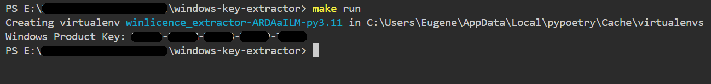

  

# WINDOWS license Key extractor

Picture that: you decided to upgrade your PC by replacing SSD, and you prefer a fresh Windows Instance for whatever reason. But you realized, you lost Windows Key you used during activation.

If you're trying to find the product key for Windows itself, it's typically stored in the system in a particular location within the registry but is encoded. The following Python script can help you decode and retrieve the Windows product key from your registry.

Here's a Python script that will help you find the Windows product key:

**Disclaimer:**

This tool does not generate a Windows License Key. It only retrieves the key that has already been provided.

I prefer working with Linux, Unix, and OSx, but some rare apps are operational only under Windows.

## How This Works
1. **get_windows_product_key()**:
   - It opens the registry key at `"SOFTWARE\Microsoft\Windows NT\CurrentVersion"`.
   - Reads the `"DigitalProductId"` value which contains the product key information.
2. **decode_product_key()**:
   - This function decodes the `"DigitalProductId"` into a readable Windows product key.
   - The key decoding logic is based on how Microsoft encodes product keys, which involves extracting and decoding from a specific offset.

## Notes
- **Run as Administrator**: This script might need administrative privileges to access the Windows registry key. To run it, ensure you have administrative privileges on your system.
- **Windows Version**: This script works for OEM and retail product keys for many Windows versions, but it may not work for some volume license versions or if the product key is stored elsewhere.
- **Python 3**: The script is written for Python 3.

### Running the Script
1. make run
2. The script will print out the Windows Product Key if it successfully retrieves and decodes it.

This method is a handy way to retrieve the key directly from your current installation without using third-party tools. If you encounter any issues or need further help, let me know!